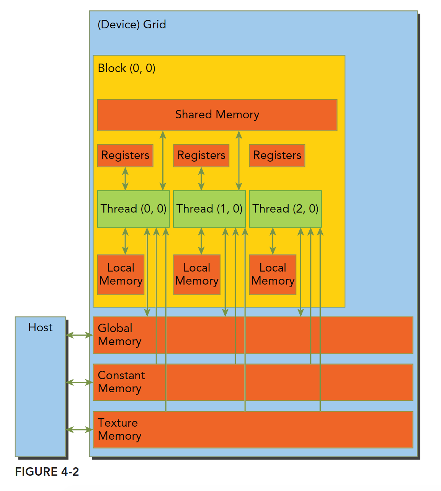

## GPU 内存结构

### GPU 内存模型

1. 寄存器
2. 共享内存
3. 本地内存
4. 常量内存
5. 纹理内存
6. 全局内存

CUDA中每个线程都有自己的私有的本地内存；线程块有自己的共享内存，对线程块内所有线程可见；所有线程都能访问读取常量内存和纹理内存，但是不能写，因为他们是只读的.对于一个应用来说，全局内存，常量内存和纹理内存有相同的生命周期。

### 寄存器

Fermi架构中每个线程最多63个寄存器。Kepler结构扩展到255个寄存器，一个线程里面的变量太多，以至于寄存器完全不够时，寄存器发生溢出，需要用本地内存扩展存储，但会使效率变低

一个线程如果使用更少的寄存器，那么就会有更多的常驻线程块，SM上并发的线程块越多，效率越高，性能和使用率也就越高。

可以在编译选项中加入
`` -maxrregcount=32 ``
来控制一个编译单元里所有核函数使用的最大数量。(用在kernel中的变量太多)

### 本地内存
核函数中符合存储在寄存器中但不能进入被核函数分配的寄存器空间中的变量将存储在本地内存中
编译器可能存放在本地内存中的变量有以下几种：

1. 使用未知索引引用的本地数组

2. 可能会占用大量寄存器空间的较大本地数组或者结构体

3. 任何不满足核函数寄存器限定条件的变量

### 共享内存

``__share__``

共享内存是片上内存,可以被编程

一个线程块使用的共享内存过多，会导致更过的线程块没办法被SM启动，影响活跃的线程束数量

SM中的一级缓存，和共享内存共享一块片上内存，通过静态划分，划分彼此的容量
运行时可以通过下面语句进行设置：

`` cudaError_t cudaFuncSetCacheConfig(const void * func,enum cudaFuncCache); ``

这个函数可以设置内核的共享内存和一级缓存之间的比例。cudaFuncCache参数可选如下配置：

``cudaFuncCachePreferNone//无参考值，默认设置``
``cudaFuncCachePreferShared//48k共享内存，16k一级缓存``
``cudaFuncCachePreferL1// 48k一级缓存，16k共享内存``
``cudaFuncCachePreferEqual// 32k一级缓存，32k共享内存``

### 常量内存

常量内存驻留在设备内存中，每个SM都有专用的常量内存缓存，常量内存使用：
``__constant__ ``

常量内存在核函数外，全局范围内声明，对于所有设备，只可以声明64k的常量内存，常量内存静态声明，并对同一编译单元中的所有核函数可见。
主机端代码初始化常量内存,不能被核函数修改.
初始化代码：

`` cudaError_t cudaMemcpyToSymbol(const void* symbol,const void *src,size_t count); ``

常量内存的读取机制是： 一次读取会广播给所有线程束内的线程,所以:当线程束中所有线程都从相同的地址取数据时，常量内存表现较好;如果不同的线程取不同地址的数据，则性能不好

### 纹理内存

这一类型的内存和GPU的滤波功能有关，不是很通用的样子

### 全局内存

最常见，默认的内存

